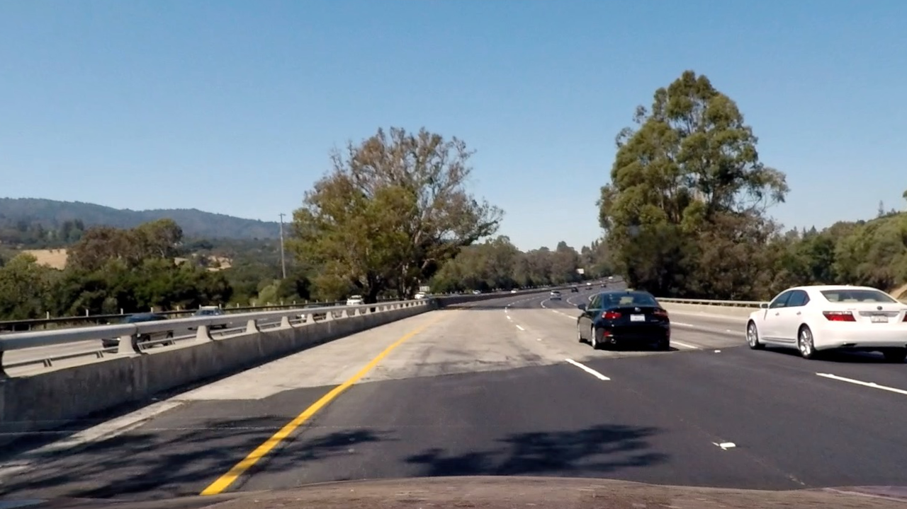
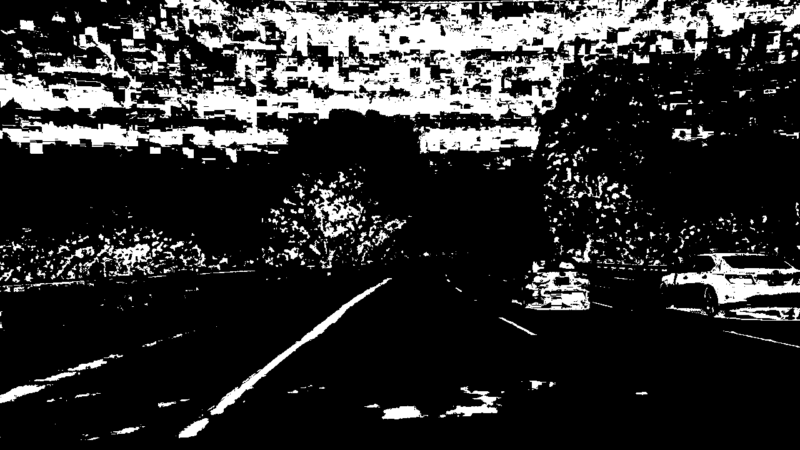
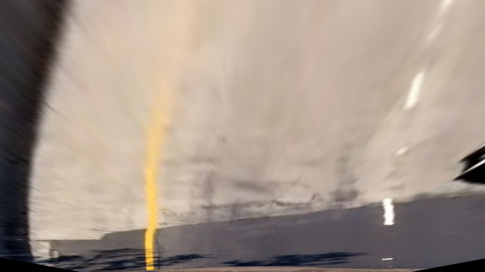
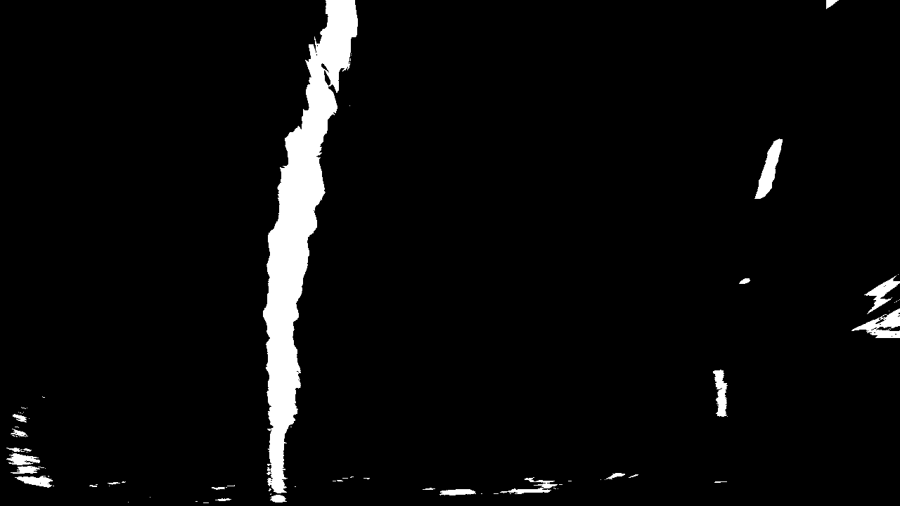
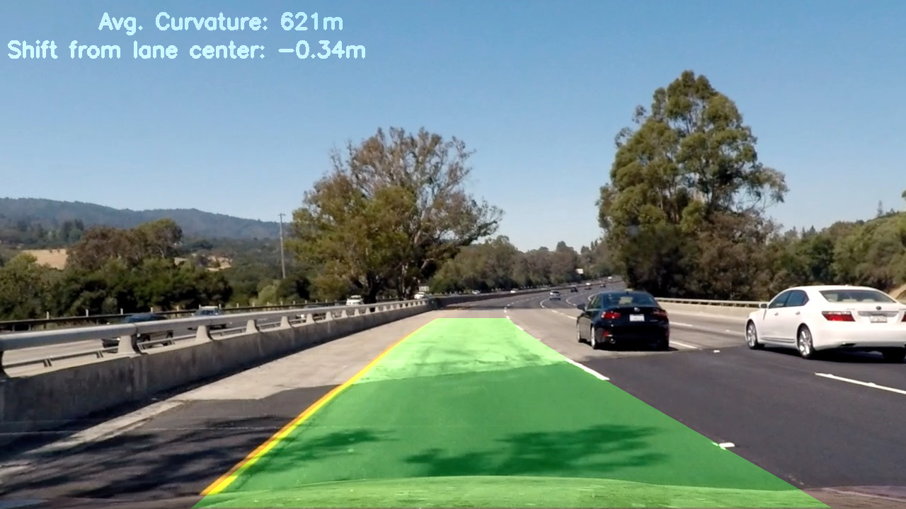

## Project 


---

**Advanced Lane Finding Project**

The goals / steps of this project are the following:

* Compute the camera calibration matrix and distortion coefficients given a set of chessboard images.
* Apply a distortion correction to raw images.
* Use color transforms, gradients, etc., to create a thresholded binary image.
* Apply a perspective transform to rectify binary image ("birds-eye view").
* Detect lane pixels and fit to find the lane boundary.
* Determine the curvature of the lane and vehicle position with respect to center.
* Warp the detected lane boundaries back onto the original image.
* Output visual display of the lane boundaries and numerical estimation of lane curvature and vehicle position.

## [Rubric Points](https://review.udacity.com/#!/rubrics/571/view) 
### Here I will consider the rubric points individually and describe how I addressed each point in my implementation.  

---
### Writeup / README

#### 1. Provide a Writeup / README that includes all the rubric points and how you addressed each one.  You can submit your writeup as markdown or pdf.  [Here](https://github.com/udacity/CarND-Advanced-Lane-Lines/blob/master/writeup_template.md) is a template writeup for this project you can use as a guide and a starting point.  

Current file
### Camera Calibration

#### 1. Briefly state how you computed the camera matrix and distortion coefficients. Provide an example of a distortion corrected calibration image.

The camera calibrarion is performed only once and the matrix coefficients are stored in the pickle file `wide_dist_pickle.p`. The code can be found in the file: `camera_calibration.py`

The 3D object points are mapped to 2D image point using the chessboard images for the calibration. Then the `cv2.calibrateCamera` is calculating the matrices  *mtx* and *dst* that are used in the images processing pipeline. 


### Pipeline (single images)

#### 1. Provide an example of a distortion-corrected image.

Once the matrices are calculated and saved, they are loaded in all the exaples that follow. A particular example of static image processing can be found in the file `pipeline_images.py`.

The initial distorted image is the following:


After the camera calibration is applied, the undistorted image looks as below:



The difference can be more easily observed at the bottom part.

#### 2. Describe how (and identify where in your code) you used color transforms, gradients or other methods to create a thresholded binary image.  Provide an example of a binary image result.
I used a combination of color and gradient thresholds to generate a binary image as described in the file `image_transformation.py` which includes all the binary and color transformations. 

In the file `pipeline_images.py`, the implementation of the transformance is performed. 

An example the binary output of the previous image is:



#### 3. Describe how (and identify where in your code) you performed a perspective transform and provide an example of a transformed image.

The code for the next step, the perspective transormation is defined in the file `perspective_tranformations.py`. The homonymous function is just using the *warpPerspective* function of cv2. The following image is showing the results:



Applying the binary transformation to that image, the lanes can be clearly identified. 




To specify the appropriate poing for the transformation an image with straight lines was used as the result of the perspective transformation will give two perpendicular lines, which makes it much easier to validate the result. 

After some trial and error the following point were applied throughout the project:

```
src = np.float32([(200, 720),(600, 450), (700, 450),  (1100, 720)])
dst = np.float32([(350, 720),(380, 0), (1060,0), (960,720)])

```

#### 4. Describe how (and identify where in your code) you identified lane-line pixels and fit their positions with a polynomial?

The function for the polynomial calculations are included in the `find_lanes_pipeline.py`. There are actually two functions: 
- The first is the `find_lanes_blind` one, where the the histogram method is applied but the algorithm has to done a thorought search using the stacked rectangles to estimate the line pixels. As the name suggests, this function should be used on the first frame or whether there is a video frame that line cannot be identified with the second function.
- The second function is the `find_lanes` which gets as arguments the fit lines from the previous frames, as initial conditions. Between two consecutive frames, there shouldn't be much difference in the lanes. It is faster therefore to search the find the new lanes lines as they should be very close to the previous ones. In the possible case where no new lines can be found, empty lists are returned to the main pipeline and a blind search is called in the next frame. 
The estimated lines along with the curvature and the shifting are shown in the next question. 


#### 5. Describe how (and identify where in your code) you calculated the radius of curvature of the lane and the position of the vehicle with respect to center.

To find the curvature and the shifting across the lane, the function *find_curvature* in the `find_lanes_pipeline.py` file is used. As long as the lane lines are identified as a second order polynomial (parabola), the curvature is calculated using the relevant expressions provided in the lectures. 
To calculate the shifting, the x-points at the bottom of the image are fisrt calculated. Their mean corresponds to the center of the lane. The difference between the center of the lane and the center of the image, roughly gives the shifting.


#### 6. Provide an example image of your result plotted back down onto the road such that the lane area is identified clearly.

Applying the aforementioned transformations and calculations the final image is the one shown below:




The result looks reasonable as the limits of the lane are conrrectly identified and the curvature and shifting numbers are realistic. 

---

### Pipeline (video)

#### 1. Provide a link to your final video output.  Your pipeline should perform reasonably well on the entire project video (wobbly lines are ok but no catastrophic failures that would cause the car to drive off the road!).

Applying the pipeline for a video file, the result is: [Output Video](https://youtu.be/huUDfgaaN70)

The code with the necessary comments is described in the `pipeline.py` file.

---

### Discussion

#### 1. Briefly discuss any problems / issues you faced in your implementation of this project.  Where will your pipeline likely fail?  What could you do to make it more robust?

The video output, looks reasonably good. There is some time interval where the left line is a bit off. I am confident that this has to do with the colour and binary transformation of the image. Optimizing these parameters is key to the correct lane identification. The fact that there is averaging of the last frames is helpful not to lose the lane but when it recovers from small deviations it requires a bit of more time. 
